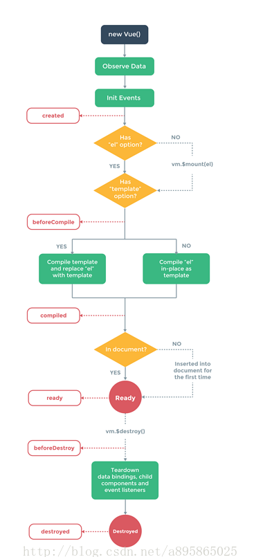
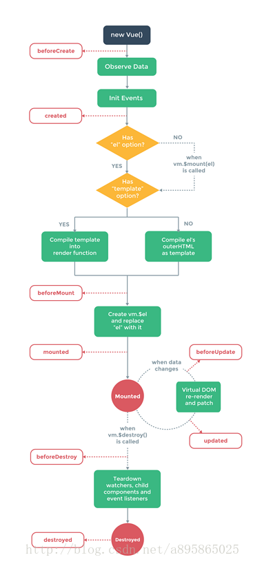

# vue 生命周期
## vue1.0生命周期
 


周期|解释
:--:|:--:
init	|组件刚刚被创建，但Data、method等属性还没被计算出来
created|	组件创建已经完成，但DOM还没被生成出来
beforeCompile	|模板编译之前
compiled	|模板编译之后
ready|	组件准备（平时用得较多）
attached	|在 vm.$el 插入到DOM时调用
detached|	在 vm.$el 从 DOM 中删除时调用
beforeDestory|	组件销毁之前
destoryed|	组件销毁之后


## vue2.0生命周期
 


周期|解释
:--:|:--:
beforeCreate	|组件刚刚被创建，但Data、method等属性还没被计算出来
created|	组件创建已经完成，但DOM还没被生成出来
beforeMount	|模板编译之前
mounted|	模板编译之后,组件准备
beforeUpdate|	组件更新之前（数据等变动的时候）
updated	|组件更新之后（数据等变动的时候）
activated	|for keep-alive,组件被激活时调用
deactivated	|for keep-alive,组件被移除时调用
beforeDestory|	组件销毁之前
destoryed|	组件销毁之后
## 生命周期钩子函数
以1.0为例
```
var v = new Vue({
		el:"body",
		data:{
			msg:'hello vue!'
		},
		created(){
			console.log('实例已经创建了')
		},
		beforeCompile(){
			console.log('在实例编译之前')
		},
		compiled(){
			console.log('在实例编译之后执行')
		},
		ready(){
			console.log('实例已经插入到文档之中')
			//可以理解成window.onload','jquery ready
		},
		beforeDestroy(){
			console.log('在销毁之前')
		},
		destroyed(){
			console.log('在销毁之后')
		}
	});
  ```
