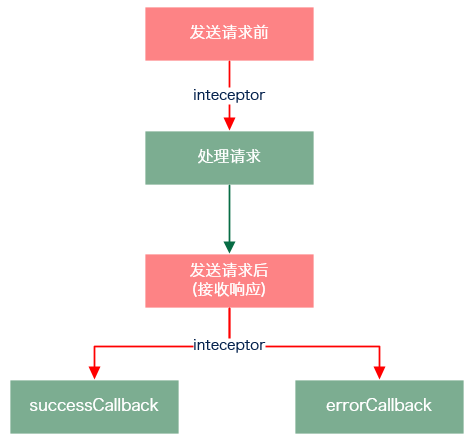

# vue-resource插件--vue使用ajax
vue使用vue-resource插件实现ajax完成前后台交互
## vue-resource支持的http方法
使用this.$http对象调用
1. this.$http.get(url, [options])
2. this.$http.head(url, [options])
3. this.$http.delete(url, [options])
4. this.$http.jsonp(url, [options])
5. this.$http.post(url, [body], [options])
6. this.$http.put(url, [body], [options])
7. this.$http.patch(url, [body], [options])
### options对象
参数|类型|描述
--|:--:|:--:
url	    |      string	      |    请求的URL
method	|      string	        |  请求的HTTP方法，例如：'GET', 'POST'或其他HTTP方法
body	  |      Object      |      FormDatastring	request body
params	  |    Object	   |       请求的URL参数对象
headers	  |    Object	  |        request header
timeout	   |   number	     |     单位为毫秒的请求超时时间 (0 表示无超时时间)
before	|      function(request)|	请求发送前的处理函数，类似于jQuery的beforeSend函数
progress	 |   function(event)	 | ProgressEvent回调处理函数
credientials|	boolean	       |   表示跨域请求时是否需要使用凭证
emulateHTTP	 | boolean	 |         发送PUT, PATCH, DELETE请求时以HTTP POST的方式发送，并设置请求头的X-HTTP-Method-Override
emulateJSON	 | boolean	      |    将request body以application/x-www-form-urlencoded content type发送
jsonp     |    string      |      传callback的参数名
## vue-resource支持的rest方法
使用this.$resource对象调用
1. get: {method: 'GET'},
2. save: {method: 'POST'},
3. query: {method: 'GET'},
4. update: {method: 'PUT'},
5. remove: {method: 'DELETE'},
6. delete: {method: 'DELETE'}  
例 get：  
```
var resource = this.$resource(this.apiUrl)
      vm = this
  resource.get()
      .then((response) => {
          vm.$set('gridData', response.data)
      })
      .catch(function(response) {
          console.log(response)
      }) 
```
例 post:
```
  var resource = this.$resource(this.apiUrl)
        vm = this
        
    resource.save(vm.apiUrl, vm.item)
        .then((response) => {
            vm.$set('item', {})
            vm.getCustomers()
        })
    this.show = false
```
例 put:  
apiUrl: 'http://211.149.193.19:8080/api/customers{/id}'
```
  var resource = this.$resource(this.apiUrl)
        vm = this
        
    resource.update({ id: vm.item.customerId}, vm.item)
        .then((response) => {
            vm.getCustomers()
        })
```
{/id}相当于一个占位符，当传入实际的参数时该占位符会被替换。  
例如，{ id: vm.item.customerId}中的vm.item.customerId为12，那么发送的请求URL为：  
http://211.149.193.19:8080/api/customers/12  
## then函数
then(successCallback, errorCallback)  
successCallback：成功时回调函数  
errorCallback: 出错时回调函数
## catch函数
catch(errorCallback)  
另一种出错处理方法  
## response对象
方法|类型|	描述
--|:--:|:--:|
text()	|string	|以string形式返回response body
json()	|Object|	以JSON对象形式返回response body
blob()|	Blob|	以二进制形式返回response body

属性|	类型	|描述
--|:--:|:--:|
ok|	boolean|	响应的HTTP状态码在200~299之间时，该属性为true
status|	number|	响应的HTTP状态码
statusText|	string|	响应的状态文本
headers|	Object|	响应头
data|Object|后台返回数据
## interceptor拦截器

### 基本用法
```
Vue.http.interceptors.push((request, next) => {
        // ...
        // 请求发送前的处理逻辑
        // ...
    next((response) => {
        // ...
        // 请求发送后的处理逻辑
        // ...
        // 根据请求的状态，response参数会返回给successCallback或errorCallback
        return response
    })
})
```
